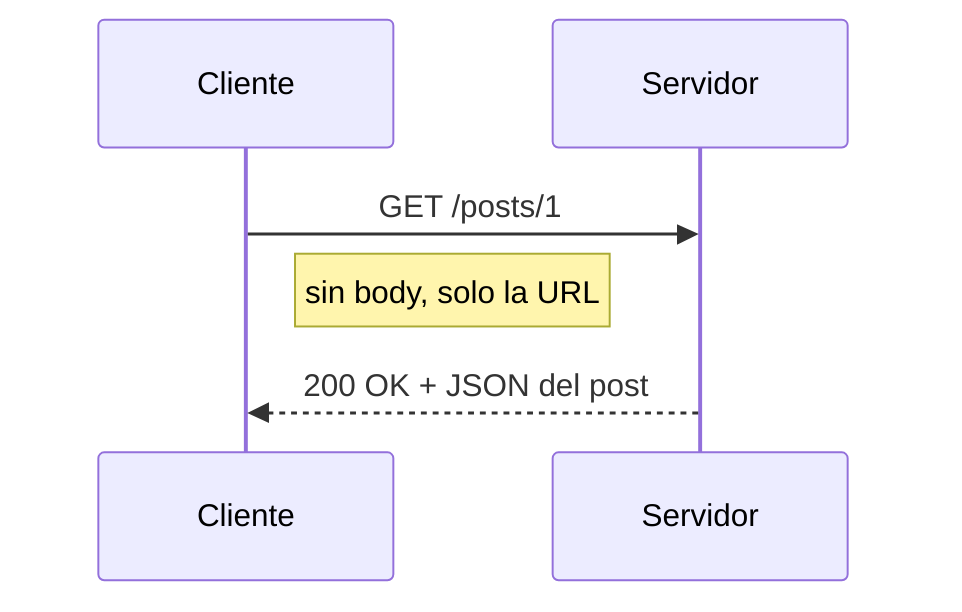
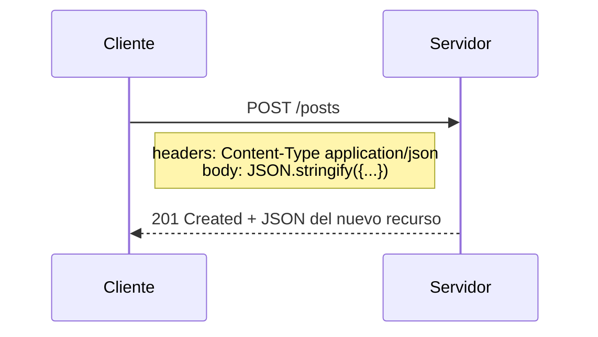

# APIs

## Concepto

Una API es un punto de contacto de un programa (endpoints/rutas) que permite conectar un sistema con otro, interno o externo, para consultar o enviar datos mediante métodos HTTP.

Los métodos más comunes:

| Método | Uso | ¿Lleva body? |
|---|---|---|
| GET | Leer datos | No |
| POST | Crear un recurso | Sí |
| PUT/PATCH | Modificar un recurso | Sí |
| DELETE | Eliminar un recurso | No (normalmente) |

## Formas de invocar fetch()

**Antes de 2017** (con `.then()`):

```js
fetch(url)
  .then(response => response.json())
  .then(data => console.log(data))
  .catch(error => console.log(error));
```

**Forma moderna** (con `async/await` — la que se usa en la práctica):

```js
async function obtenerDatos() {
  const response = await fetch(url);
  const data = await response.json();
  console.log(data);
}
```

**Conclusión:** ambas hacen lo mismo. `async/await` ganó porque el código se lee de arriba hacia abajo como si fuera síncrono, en vez de anidar `.then()` tras `.then()`. En la práctica, toda función que use `fetch` va a ser `async` y va a usar `await` adentro.

## ¿try/catch siempre?

Sí, es lo recomendado. Con `fetch` hay dos tipos de error distintos, y solo uno cae solo en el `catch`:

- **Error de red** (sin conexión, DNS caído): hace que la Promise de `fetch` se rechace → cae automático en el `catch`.
- **Error HTTP** (404, 500): la Promise se resuelve igual, con éxito. Hay que chequear `response.ok` a mano y generar el error con `throw`.

```js
async function obtenerRecurso(id) {
  try {
    const response = await fetch(`https://api.ejemplo.com/recurso/${id}`);

    if (!response.ok) {
      throw new Error(`Error ${response.status}`); // error HTTP: lo detectás vos
    }

    const data = await response.json();
    return data;
  } catch (error) {
    console.log("Falló la request:", error.message); // acá caen: error de red + el throw de arriba
  }
}
```

`response.ok` es un chequeo sobre el status HTTP de la respuesta ya recibida: `true` si el status está entre 200 y 299, `false` en cualquier otro caso.

## Parámetros en otros métodos (POST, PUT, PATCH)

Para GET, `fetch(url)` alcanza con un solo argumento. Para los métodos que envían datos, `fetch` necesita un segundo argumento: un objeto de opciones con estas propiedades principales.

- **method**: el método HTTP a usar (`"POST"`, `"PUT"`, `"PATCH"`, `"DELETE"`).
- **headers**: metadatos de la request. El más común es `"Content-Type": "application/json"`, que le indica al servidor que el body viene en formato JSON.
- **body**: los datos que se envían. Van procesados con `JSON.stringify()`, porque el body de una request viaja como texto, no como objeto JS.

```js
const response = await fetch(url, {
  method: "POST",
  headers: {
    "Content-Type": "application/json"
  },
  body: JSON.stringify({ titulo: "Hola", userId: 1 })
});
```

Resumen rápido: `JSON.stringify(objeto)` convierte un objeto JS en texto JSON para mandar; `response.json()` hace el proceso inverso, convierte el texto JSON de la respuesta en objeto JS para recibir.

## Diagrama: GET vs POST

**GET — pedir datos**



**POST — crear un recurso**

